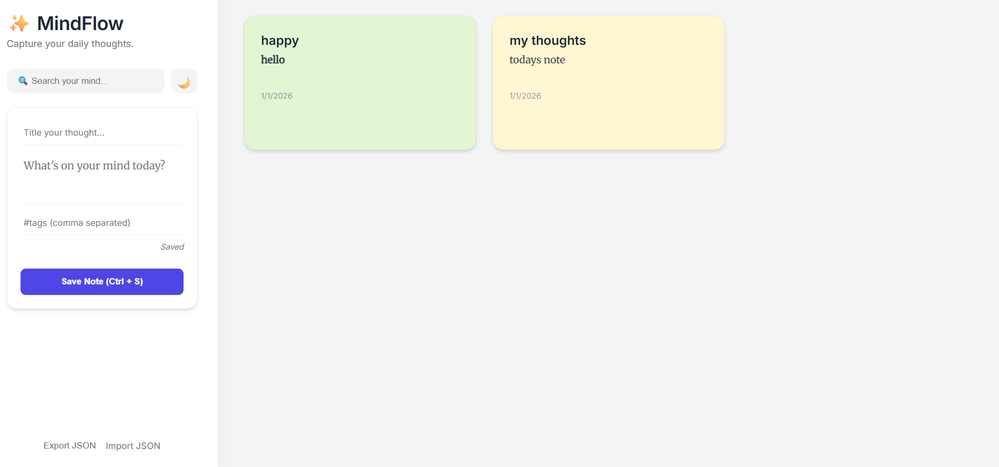
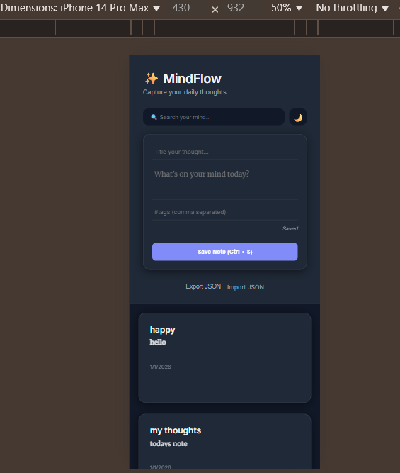

#Personal knowledge Management Web App  
A feature-rich personal knowledge management web application built with vanilla JavaScript, supporting efficient note organization and persistence.
## 🚀 Features

- Full CRUD operations for notes
- Real-time search across titles, content, and tags
- Tag-based organization and pin/unpin support
- Dark mode with persistent user preference
- Import and export notes using JSON
- Persistent storage using browser LocalStorage
## 🛠️ Tech Stack

- HTML5
- CSS
- JavaScript 
- LocalStorage API
## ⚙️ High-Level Overview

-User interactions (creating, editing, deleting notes) are handled through an event-driven JavaScript architecture. 
-All application data is persisted locally using the browser’s LocalStorage API, ensuring data availability across sessions. 
-The user interface is dynamically updated through DOM manipulation, eliminating the need for page reloads. 
-Features such as search, tagging, pinning, and theme switching are implemented as independent UI behaviors layered on top of the core state logic.
## ▶️ Running the Project Locally

1. Clone the repository
2. Open `index.html` in a modern browser
3. Start creating notes
## 📸 Screenshots

### Light Mode

### Dark Mode

 
These above screenshots displsy the dark and light theme along with that one can see the responsiveness too.
## 🎯 Learning Outcomes

- State management in frontend applications
- Efficient DOM manipulation
- Client-side data persistence
- Event-driven UI development

